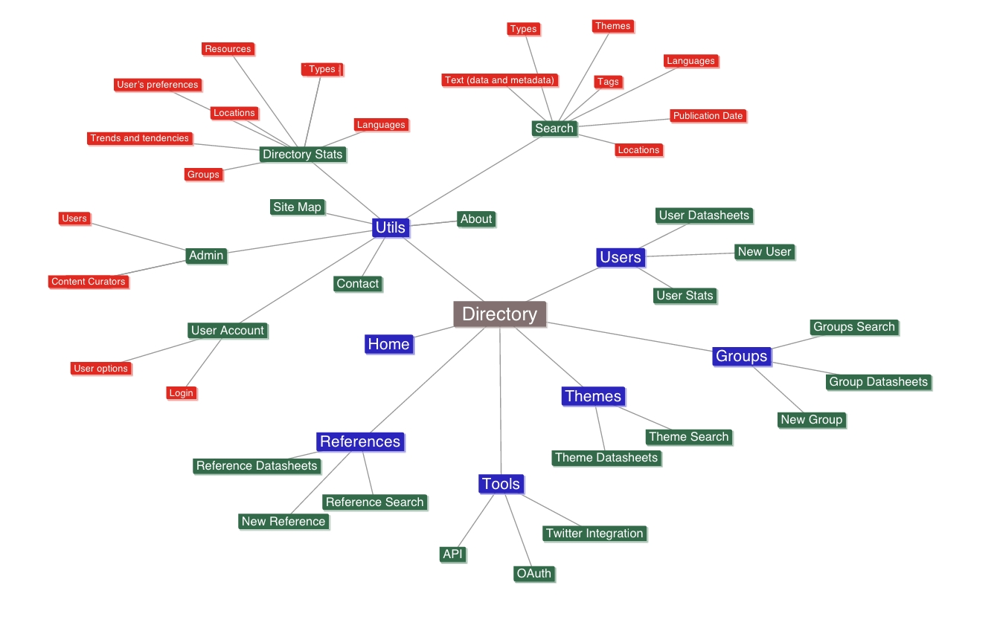

# {{ page.title }}

DRAFT - 2 April 2013

* Toc
{:toc}

Background and Context 
----------------------

Quality rich information and content references is a need when you are dealing with innovative environments such as Open Data, where sharing and reusing are necessary routines in order to advance, and to give Open Data initiatives the visibility and recognition they need.

Although only a few years ago it was nearly impossible to find information and examples of Open Government Data initiatives and their components, there are currently a growing and varied number of Open Data resources all over the Web.

Given the increasing number of Open Data and PSI re-use activities all around the world, and the social, economic or cultural diversity within the different countries, no single person or organisation could grasp the whole scope of such a huge amount of information.

Any Government or organization interested in Open Data would greatly benefit from the existing and growing knowledge base and resources, so this scenario represents an invaluable opportunity to construct a neutral and trustable central directory that can help us to structure references, share best practices, and, generally speaking, mobilize the global Open Data community around it.

### Objectives 

The main objective of this work will be the definition use cases and functional and architectural requirements for an Open Data Directory platform (ODD from now on) to support such a global directory of Open Data references and related information resources, that can range from scientific papers and studies to blog posts and to applications developed on top of Open Data.

The mission of the ODD would be to:

1.  Provide leadership in the domain
2.  Federate existing resources and act as a clearinghouse for them 
3.  Facilitate replication of successful examples
4.  Help understand the challenges and benefits associated to Open Data
5.  Provide a best practice itself

For that, this reference directory will not initially compile a vast number of References but will give priority to high-quality References endorsed by the Open Data community. The directory will be open to everybody’s contributions, but a group of content curators will be in charge of updates, evaluating any proposed reference before its incorporation.

Although this approach may raise some disadvantages with regards to flexibility it will also lead to great benefits, mainly higher quality and better organisation in the compilation of resources. An intermediate approach where frequent contributors can also act as content curators is also possible.

The expected final result will be a curated directory of valuable organized references that are considered a must know for any Open Data stakeholder, including public administration, academia, civil society, private sector, non-governmental institutions, professional consultants, media and publishing industries or topic specialists among others.

The directory will serve as guidance on issues such as:

1.  Existing Open Data initiatives and reference institutions.
2.  General questions and doubts about Open Data.
3.  Technical questions on associated standards and technologies, such as formats, metadata, linked data, etc.
4.  Guidelines and best practices for data publication and reuse.
5.  Open Data policies and methodologies.
6.  Impact studies and thematic reports: Economic, Social, Legal, Accountability, etc.
7.  Implementation of Open Data in strategic areas such as: Health, Science, Transportation, Energy, Education, etc.
8.  Educational and dissemination materials.
9.  Examples of services, applications and products.

USER PROFILES AND ROLES 
-----------------------

Open Data initiatives should be seen as collaborative projects within a changing environment, where the end may not be clear and the coordinating entities do not have all the resources to create needed change by themself.

This is why Open Data need to be developed by an amazing variety of people with varying interests and incentives. It is not just about government, business, academic and certain institutions, but also about individuals, non-profits or any other informal group of people that have already proved to be instrumental in its operation and growth.

### Stakeholders groups 

  
The ODD should then serve a wide audience of Open Data Stakeholders, including any group that has a direct or indirect interest and could play an active role in an Open Data initiative, from those who conduct, participate in, fund, or manage the initiative to anyone that may otherwise affect or be affected by it.

It has to start at the top, it has to start in the middle and it has to start at the bottom.

The following classification of the different Open Data stakeholders is based on the Web Foundation OGD readiness assessment methodology[^1].

#### Public Sector  
 

The public sector is the part of the state that deals with the production, ownership, sale, provision, delivery and allocation of goods and services by and for the government or its citizens, whether national, regional or local.  
  
It also includes those enterprises that are part of the state and not outsourced, i.e. publicly owned corporations, which differ from direct administration in that they have greater commercial freedoms, they are expected to operate according to commercial criteria, and production decisions are not generally taken by government (although goals may be set)

This group could also be subdivided into three levels according to the specific role they could play in an Open Data initiative:

1.  Government Top-Level: Including Presidents, Vice Presidents, Prime Ministers, Ministers, Vice Ministers, Director-General, Heads of Agency, etc.

Their main role will be to provide political guidance and support as well as top-level management.

1.  Government Mid-Level: Including Heads of Division, Special Advisors, etc.

Their main role will be to guide the implementation, policy-making and agenda setting.

1.  Government Lower Levels: Typically Civil Servants.

Their role will be the implementation, policies and technical support.

#### Private Sector 

  
The part of the economy, which is run by private individuals or groups, usually as a means of enterprise for profit, and is not controlled by the government.

Their role is to provide tools and infrastructures, as well as build business on Open Data.

#### Donors, Foundations and International Organizations 

  
Those international organizations that can contribute with funding, knowledge transfer and capacity building or other valuable assets to the OGD cause without any expected benefit for themselves other than their believe in all people having the opportunity to reach their full potential, contribute to society, and have voice in the decisions that affect them.  
  
These organizations work to help building common understanding, encourage initiatives, create networks, promote collaboration and enhance excellence to improve people’s lives and reinforce their commitment to society.

Their role will be to fund initiatives, transfer knowledge and build capacity.

#### Civil Society Organizations 

  
The Civil Society Sector is quite varied in its nature and composition, including a wide array of non-governmental and not-for-profit organizations that have a presence in public life, such as NGOs, advocacy groups, trade unions, faith-based organizations, indigenous groups, professional associations, cultural institutions and many more, and have become important actors for delivery of social services and implementation of other development programs, as a complement to government action.  
  
As global market integration has advanced, their role has gained particular importance in aligning economic activities with social and environmental priorities. CSOs are now critical actors in the advancement of universal values around human rights, the environment, labour standards and anti-corruption. They are dedicated to serving a particular function and are driven by people with a common interest in addressing these issues.  
  
CSOs are critical actors that perform a variety of service, development and humanitarian functions. These can include undertaking research, distributing information, training, lobbying for legislative change, advocating particular causes, monitoring government policies, and encouraging political participation.

They play a very important role as Open Data users and advocates.

#### Academia / Research 

The scientific and cultural community engaged with studying, thinking and research taken as a whole, especially universities and research centres.

Their role consists on using Open Data in research as well as develops theoretical concepts, frameworks and prototypes.

#### Civic Hackers 

  
A group of people with technical skills that use them to solve public problems, building new ways of identifying solutions, connecting public and government, and making things work for the better under the belief that information-sharing is a powerful positive good, and that it is an ethical duty to share their expertise by facilitating access to information wherever possible  
  
They are simple citizens, usually working independently and most often without financial reward, to develop their own services and applications, based on government data, which give people simple and tangible benefits in the community aspects of their lives by solving particular problems of a civic nature.

They role is to apply their technological and civic skills to analyse data and develop applications that make sense of it, providing benefits for the community.

#### Media 

Mass communication channels through which news, entertainment, education, data, or promotional messages are disseminated to a large audience. It includes newspapers, magazines, radio, television and the Internet.  
  
By covering news, politics, weather, sports, entertainment, and vital events, the daily media shape the dominant cultural, social and political picture of society. Today, the need to be able to access and filter that continuous stream of information has become much more important in newsrooms. By using data, a journalist’s focus shifts from being the first person on the scene to being the one who provides context to an event and aims to explain what it really means.  
  
This new data-driven journalism usually deals with open data that is freely available online to reach new levels of service for the public, helping consumers, managers or politicians to understand patterns and make decisions based on the findings. As such, data driven journalism might help to put journalists into a role relevant for society in a new way.

They role is to use Open Data for daily reporting and data journalism.

### Data-driven Classification 

The activity of all data stakeholders revolves around data life cycle. If we look at the role they play during the different stages of that cycle, we can also come to the following alternative data-driven classification for the stakeholders.

#### Data producers 

Those that produce valuable data during its daily activity that could be published to create added value. They can be mainly found at:

1.  Public Sector: e.g. Government data.
2.  Private Sector: e.g. Business data.
3.  Donors, foundations and international organisations: e.g. funding data.
4.  Academia: e.g. Science data.

#### Data consumers 

Those that consume data during its daily activity and could benefit from data being published to create added value. They can be mainly found at:

1.  Public Sector: e.g. Government interoperability.
2.  Private Sector: e.g. Data market.
3.  Civil Society Organisations: e.g. Data for social goodness.
4.  Academia: e.g. Data analytics.
5.  Civic Hackers: e.g. Civic data apps.
6.  Media: e.g. Data journalism.

#### Data intermediaries 

Those that transform or adapt data during its daily activity and could both benefit from data being published and publish new valuable data after its transformation. They can be mainly found at:

1.  Private Sector: e.g. Data consultancy.
2.  Civil Society Organizations: e.g. Data advocacy.
3.  Academia: e.g. Data research.
4.  Civic Hackers: e.g. Apps developers.

#### Data specialists 

Those that deal with data related activities during its daily work and could help improve the way data can create added value. They can be mainly found at:

1.  Public Sector: e.g. Topic specialists (health, transportation, education…)
2.  Private Sector: e.g. Cross-topic specialists (legal, economic, entrepreneurship…)
3.  Academia: e.g. Data Scientifics.

USE CASES AND SCENARIOS 
-----------------------

Given the diverse audience it will serve, the Open Data Directory will also need to address a wide range of use cases and scenarios.

Having a good idea of how the different actors play different roles across a variety of use cases will help us to better understand how the stakeholders will interact with the Directory through the multiple possible scenarios.

### Personas 

A Persona represents a cluster of users who exhibit similar patterns in their use of technology, services or products. Behaviours, attitudes, and motivations are common to a given Persona type regardless of age, gender, education, and other typical demographics.

The following fictional Personas, based on the needs from real Open Data stakeholders, will provide several illustrative examples of use cases and scenarios where the Open Data Directory could be considered a useful resource.

#### Persona 1 - Noa  

Noa is a mid-high level government executive. She is Director-General for Citizen Services. Noa tries to be quite innovative and is always looking for ways to improve her work and the relationship between citizens and government. She heard of Open Data at a conference. She needs to find information to learn more about what it is and if would be useful for her job. Once she gathers some References at the ODD on most advanced governments, learns about the benefits and costs of such initiatives, and thinks seriously about it, she believes this is something she would like to start.

Noa meets with her boss, the Vice-Minister, who is the decision maker for this kind of actions in her department. The Vice-Minister didn’t know much about Open Data, just heard the concept, and it’s not very interested on it. He’s concerned about too much transparency, don’t want to see another wikileaks case because of such a project and, besides, the budget is too constrained, so even if this would be a good idea, he could not approve it, as it will be a cost his department cannot afford.

 

Noa is frustrated but wants to keep on pushing the idea. She goes to the ODD with the Vice-Minister’s concerns in mind and filters the information to get specifics: studies on economic impact in the territory, reports that show that an Open Data initiative is an investment and not a cost and that can be done for small money compared to other projects in her department, a couple blog posts from experts on the differences between wikileaks and transparency and Open Data and a few applications, including one on the government investments in civil works over the last five years that can be seen on a map; she knows the Vice-Minister will love that one as he is former Director-General at that department and is a savvy smartphone user.

She has also added to the ODD a couple of additional published reports on the state of Open Data in her country that she was well aware because she was involved in their preparation.

#### Persona 2 - Max  

Max is a software developer. She has extensive experience on open web standards and open source platforms. The new project at his agency is to support a government to create an Open Data catalogue where open source is a requirement. He perfectly knows the tools out there to build portals, but starts researching what others have done in similar projects. Using a search engine, he starts to find several blog posts and articles pointing to several catalogs. He reviews them but it’s hard for him to find information on the platform itself. He finds some elsewhere but in most cases he sees it refers to either open source tools he already knew or interesting proprietary software that he could not use in this project.

At the ODD, Max can easily find all References connected, learn what’s the underlying software of a specific data catalogue, the costs involved in tweaking the platform, the community behind it, and even a comparative analysis of the platforms in use worldwide so he can make an informed decision. He is also starting to use the ODD to organise and share the multiple references he has been collecting.

#### Persona 3 - Akio 

Akio is a freelance journalist fascinated by the new possibilities that open up when you combine the ability to tell a compelling story with the increasingly scale and range of public information now available.

He has seen several impressive examples of how the combination of several public data sources can lead to really powerful stories with engaging infographics and he would love to be able to create something similar by himself.  Unfortunately Akio feels that he doesn’t have the technical skills and expertise to do it by himself and he needs an update urgently, but other journalists have explained him that there are currently several free online tools and tutorials available, and after some practice he should be able to start creating his own data stories with little efforts.

Thanks to the ODD and after some searching time Akio was able to find a complete set of software tools for data journalism, several tutorials and step-by-step guides that will help him to master them, a complete data journalism handbook and lots of References with valuable data sources he would like to explore.  He plans to use one of the tools and a video-tutorial he found to experiment and create his first data story over the next weekend.  He is also now an active contributor to a Group of Resources about Open Journalism he found really useful at the beginning.

#### Persona 4 - Lealman 

Laalami is a Civic Hacker and programmer employed by a non-profit organisation that is devoted to offer solutions for civic problems by a technical approach. He believes that the Internet can meaningfully lower the barriers to taking the first civic or democratic steps in citizen’s life, building new ways of identifying solutions, connecting public and government and making things work for the better at scale.

He loves to explore the Open Data Directory from time to time looking for inspiration, analysing the open data policies that affect to his own country and creating his own Reference groups for later analysis. Thanks to the Directory he can also look for what other similar organisations are doing all around the world almost at real time, because he is subscribed to the results of a customized search for CSOs-related References. The financial means of the non-profit where he works are quite limited, so he also loves to search for open source applications based on government data that solve problems of civic nature. This way he can easily adapt and reuse them at low cost in his country.

Now Laalami is collaborating with other local organisations and they plan to setup the first Open Government Data hackathon in the region. This is something completely new for him, so he looks again at the Directory in search of similar experiences and he found several valuable References, including a complete beginner’s guide on how to set-up a successful hackathon. He is also using the ODD to keep track of References about similar experiences all around the world.

#### Persona 5 - Selena 

Selena is a Telecom Engineer who combines his R&D&I activity with her role as Smart Cities Project Manager at one of the biggest cities in Europe. During the last years she has been working on how to apply Information and Communication Technologies with the aim of providing infrastructures that promote sustainable development and at the same time increase citizens quality of life as well as efficiency.

She believes that Smart Cities initiatives would enormously benefit from Open Data to address management and citizenship information needs. She would love to explore the possibilities, but that is a complex task given that Smart Cities make use of a wide range of technologies, both at hardware and application levels, that affect a large number of sectors such as environment, energy or transportation.

Selena turn to the Open Data Directory in search of reference models on how to manage an Open Data network in a Smart City context, as well as useful examples of technologies and applications that make an innovative use of data coming from ours cities to get inspired. She has now become a frequent user and contributor to the Environment, Energy and Transportation Themes.

#### Persona 6 - Eneko 

Eneko is a PhD student exploring the impacts of Open Data policies on social development at low and middle-income countries. He knows that during the last years, a diverse group of stakeholders have embraced and sponsored open data programs all around the world, creating expectations about how open data can act as a suitable remedy for challenges of good governance, economic growth, social inclusion, innovation, and participation.

He wants to focus his research on how these claims may be justified and whether these promised outcomes could indeed occur and under what circumstances when we apply them to development countries.

For Eneko the Open Data Directory is a useful tool where he can look for all sort of methodologies, reports and studies in search of empirical evidence to underlie implementation of Open Data initiatives and to guide better practice and policy formulation, particularly as it spreads to developing countries. He has started a Group of Resources at the ODD focused on scientific papers on the matter, with more than a hundred participants currently.

In addition, Eneko is also an Open Science advocate and he believes it is a decisive element in strengthening the innovative capacity as well as a central instrument for improving the dissemination of scientific results. He uses the Open Data Directory also to look at other Open Science experiences and see the tools, vocabularies and methods they use when sharing their research data.

#### Persona 7 - Miguel 

Miguel is an Open Data Independent Consultant with extensive hands-on experience acquired by the setup of more than twenty local, regional and national Open Data projects and initiatives all around the world in both, public and private areas. He is also an active participant of several global online communities related to Open Government and Open Data since long ago. Of course, the Web and Social Networks are also his reference handbooks to keep himself up to date with Open Data and the latest trends and tendencies.

When he started working on Open Data four years ago there was not much information about it, thus the first projects were difficult because he needed to create new policies and methodologies by himself, but at the same time the Open Data community was quite reduced and it was easy to share findings and know what where others doing. Nowadays things have changed and the amount of information and References available has grown in the same proportion as Open Data initiatives, and that makes increasingly difficult to keep up-to-date.

Miguel is a frequent user and contributor to the ODD, as he returns to it every time he has to start a new project, prepare a dissemination action or carry out a new research in search of the references and resources he needs to conduct a preliminary analysis, get educational materials or look up for the most recent topic reports.

SYSTEM SPECIFICATIONS 
---------------------

This section describes the system specifications on scope, design and features for the development of an Open Data Directory that will serve as central repository of valuable organized references considered a must know for any Open Data stakeholder.

System components.

The different system components with regards to the established requirements are described as follows:

1.  General requirements: Global requirements applicable to the whole system.
2.  System Platform: the platform under which the Directory will be developed. This can be an already existing platform or a new ad-hoc one that has been built for the Directory.
3.  Open Data Directory: the core functionality for the Open Data Directory.
4.  API: the Application Programming Interface intended for application communication with the Directory.

### General Requirements 

G1 – The system will fulfil the general principles of the Web Architecture[^2] and the One Web[^3].

G2 – The system will be based on Open Web standards.

G3 – The system infrastructure will be developed as an open source project whose source code will be published on any widely known repository.

G4 – The system will be fully accessible to people with disabilities.

G5 – All metadata and stored data will be openly available.

G6 – The system will provide an Application Programming Interface (API) for software clients to interact with the contents.

G7 – The system will have a consistent visual identity and navigation.

G8 – The system will look for a pleasant user experience.

G9 – The system will be compatible with the identification, representation and exposition principles[^4] of Semantic Web and Linked Open Data.

### Platform Requirements 

P1 – The platform site must be developed using Open Web Standards technology, with xhtml 1.0 and CSS 2.1 valid code as baseline frontend technologies, and should incorporate HTML5 and CSS3 features when considered stable and beneficial.

P2 – The platform must be fully compatible with current popular browsers[^5], while remaining also usable in other browsers and older versions.

P3 – The platform must be ready to meet the Accessibility requirements defined by the AA level of the W3C WCAG 2.0 Guidelines.

P4 – The platform must use user-friendly and semantic unique URIs that must keep device, language and technology independency.

P5 – The platform must be ready for full internationalization, including interface, functionality, data and metadata.

P6 – The platform website must include tools for users participation and outreach.

P7 – The platform must be able to manage multimedia content.

P8 – The platform should integrate promotion and dissemination tools.

P9 – The platform must be able to be fully redeployed (both content and functionality) in a new environment.

P10 – The platform will support the creation and management of user profiles and personal preferences.

P11 – The platform will provide OAuth[^6] access options to get users login by means of their favourite social network profiles.

### Directory Requirements 

D1 - The directory will collect and publish detailed statistics about its daily operation, the availability of references and the way in which they are used.

D2 - The directory must provide metadata about the items listed and itself.

D3 - Metadata modelling will be performed using internationally recognized vocabularies whenever possible.

D4 - The directory must provide the functionality needed (CRUD) to manage Resources, Groups, Users and their metadata.

D5 - The directory must provide advanced search and filtering capabilities for the recorded items.

D6 – External collaborators should be able to suggest their own Resource items.

D7 - Automated capture of Resource items will be also possible by aggregation of different information sources (RSS, social networks, etc.) and their machine processing through different filters (keywords, redundancy, etc.).

D8 – Resource items must be approved by a registered content curator before publication.

D9 – Users will be allowed to create their own References spaces.

D10 – Users will be allowed to interact with other users through shared Groups of Resources.

### API Requirements 

A1 – The API will be a complement and not a substitute for bulk data access.

A2 – The API will be fully documented, including examples of requests, responses and error codes meaning with suggested valid parameter values.

A3 – The API will be implemented as a RESTful[^7] web service, using HTTP and the REST principles.

A4 - URLs generated by the API should be absolute URLs.

A5 – The API will support the use of standard XML and JSON data formats.

A6 – When necessary the API may offer multiple methods of authentication to accommodate user preferences.

A7 – The API will include open source reference implementations for at least the latest stable versions of the programming languages Java and Python.

A8 – The use of query-string parameters should be avoided and limited to certain filtering operations, not for resource names.

MOCKUPS AND FUNCTIONAL SPECIFICATION 
------------------------------------

This section describes a proposal for the overall Information Architecture, the main sections and their functional requirements for this central entry point to Open Data related References at a neutral and trustable directory.

The intention is to describe what is needed by the system, but not to define the inner workings of the proposed system or how it should be implemented. Instead, it focuses on how the different stakeholders might interact with the system.

### Information Architecture 

### Home page 

1 – Tools

This is a permanent area that will be present all around the web site. Here we will find quick access to several frequently used tools, such as:

1.  Language: Dropdown with web site language selection (english will be the default option).
2.  Home: Link to the homepage (disabled at the home page).
3.  Search: Dropdown with search box and advanced search link.
4.  Add Reference: Link to the New Reference page where you can add a New Reference to the Directory and associate it to your profile (or one of your groups) if you want.
5.  Login: Dropdown with login option (user and password, password recovery and new user) OAuth login options will also available to get you use your favourite social network profile as user login.
6.  Twitter: Link to the Directory Twitter profile.

2 – Intro

An introductory area with a short explanation about what Open Data[^8] is and why the Open Data Directory is needed. This area should combine text and video resources.

3 – Quick Search Area

A key functionality at the Home page.  This area will allow a quick search with basic Type filters based on the types taxonomy, as well a prominent link to add a new Reference to the Directory.

Each of the links from the Type filters will take us to a search results page with all the References for that Type category. The size of the links will be proportional to the number of References that the Directory has for each of the Types.

Advanced Search options should include at least:

1.  Themes filters.
2.  Types filters.
3.  Date filters.
4.  Geographical filters.
5.  Language filters.
6.  “Order by” options: Popularity (default), Publication Date, etc.
7.  Number of results per page.

4 – Groups Area

The Directory will allow the creation of Groups of References. This area will highlight the most popular Groups by means of including the Group name (linked to the Group page) and description, as well as the of the Group creator linked to his/her profile.

The selection of popular Themes will be based on the following criteria:

1.  Groups which References have more views.
2.  Groups that have more views.
3.  Groups that have more members.
4.  Newest Groups.

The criteria on how to select highlighted Groups can be configured and adjusted through the administration options.

A link to the Groups page will also be provided through the area header, as well as and at the end of the list of Groups. A link to a RSS channel informing about last Groups created will also available.

5 – Themes Area

The Directory references are organised by thematic areas according to the Themes taxonomy. This area will highlight the most popular Themes by means of including their icons linked to the Theme page.

The selection of popular Themes will be based on the following criteria:

1.  Themes which References have more views.
2.  Themes that have more References available.
3.  Themes that have more Groups about them.
4.  Themes that have been queried more times.

The criteria on how to select highlighted Themes can be configured and adjusted through the administration options.

A link to the Themes page will also be provided through the area header, as well as and at the end of the list of Themes.

6 – References Area

References are the main content of the Directory. This area will highlight the most popular References by means of including their title linked to the Reference page.

The selection of popular References will be based on the following criteria:

1.  References that have more views.
2.  References that have been included in more Groups.
3.  Newest References.

The criteria on how to select highlighted References can be configured and adjusted through the administration options.

A link to the References page will also be provided through the area header, as well as and at the end of the list of References. A link to a RSS channel informing about last References incorporated to the Directory will also available.

7 – Footer

Footer area should include at least the following information:

1.  Logos: logos with links to the project promoters.
2.  Frequently Asked Questions: with basic user help contents.
3.  About: with some background info about the Directory and its promoters.
4.  Contact: contact information for enquiries and support.

### Search 

1 – Tools

Same as before, but once logged in the user will have a personalized link to his profile and some additional options while browsing the web site.

2 – Location

Web site identity, including name and/or logo linked to the home page, and breadcrumbs navigation that serves both, as additional navigation system as well as location mechanism within the web site.

3 – Search Results

Search box and link to advanced search options.

The results of the search will include the text query that was used and the number of total results. Results will be paginated in groups of ten.

4 – Results Item

Each item of the results will include a brief description of the Reference with the following metadata:

1.  Title: the title of the Reference linked to the Resource itself.
2.  Description: brief description of the Reference.
3.  Theme: the Theme under which the Reference has been classified according to the Themes taxonomy. You will be able to access other References for the same Theme when you click on it.
4.  Type: the Type of Reference according to the Types taxonomy. You will be able to access other References for the same Type when you click on it.
5.  GEO: Locations where the Reference is applicable or related to. You will be able to access other References for the same location when you click on it.
6.  Publication Date: How much time ago the Reference was included in the Directory (last week, month, quarter, semester, year or more)
7.  Views: number of times that the Reference has been visited.
8.  TAGS: the different free tags used by people to describe the Reference. You will be able to access other References with the same tag when you click on them.
9.  Personalised Options: Additional actions that are available once you are logged in, such as adding the current Reference to your personal list, a modal window with additional options to include it in one of your groups or add a comment.

 

5 – Search filters

The Results list can be refined thanks to a series of additional filters. The filters will behave such as in a faceted search, so unless otherwise indicated the general behaviour is to act as AND conditions and each filter we apply will have an immediate effect over the number of search results. Available filters will include:

Themes: to select the Themes you want to include or exclude from the results list. Only your favourite Themes (those for which you have saved more References) will be selected by default once you are logged in if you have indicated so at your user preferences.

Each of the Theme options will indicate the number of References available for it in this search, and only the Themes with more References for the given search will be shown at first. An additional option will indicate the number of References available for the rest of Themes and let you also choose from them through a modal or dropdown menu. The numbers of results will be updated each time you apply a new filter according to the new search results.

Types: to select the Types you want to include or exclude from the results list. Only your favourite Themes (those for which you have saved more References) will be selected by default once you are logged in in if you have indicated so at your user preferences.

Each of the Type options will indicate the number of References available for it in this search, and only the Types with more References for the given search will be shown at first. An additional option will indicate the number of References available for the rest of Types and let you also choose from them through a modal or dropdown menu. The numbers of results will be updated each time you apply a new filter according to the new search results.

Languages: to select the Languages you want to include or exclude from the results list.  Only your favourite Languages (those you selected at your user preferences) will be selected by default once you are logged in in if you have indicated so at your user preferences.

Each of the Language options will indicate the number of References available for it in this search, and only the Languages with more References for the given search will be shown at first. An additional option will indicate the number of References available for the rest of Languages and let you also choose from them through a modal or dropdown menu. The numbers of results will be updated each time you apply a new filter according to the new search results.

Publication Date: this option let you filter on the basis of how much time ago the Reference was included in the Directory. You will be able to select from a range of predefined periods of time (last week, month, quarter, semester, year or more).

Tags: to filter the results list by a given topic from those used to tag the References of this specific search. The size of the tag will be proportional to the number of References that the search results have for it.

GEO: a map to select the Location where you want to focus the search results. The number of References in this search for each Location will be shown on the map.

An option to reset all filters will also be available at the top of the filters section.

### Reference 

1 – Description and Social

Reference description including a title linked to the Resource itself and a brief text description of the Reference.

This area will provide also some social functionalities such as links to easily share the content at the most frequent social networks (at least Twitter, Facebook, LinkedIn and G+ should be available options), as well as the number of views (for the Reference datasheet) and/or reads (following the Reference link) for the Reference.

A permanent link to the Reference will also be provided following the Directory URI scheme specifications, as well as link with a dropdown menu to add the current Reference to your profile, and to one of your Groups if you want, once you have logged in.

There will be also the possibility of seeing what people has been commenting about this Reference (including comments from the different social networks), as well as adding a new comment once you have logged in.

2 – Metadata

This area will expose metadata information about the Reference such as:

1.  Language: the language or languages used in the Reference.
2.  Creator: the entity or person primarily responsible for authoring the Reference.
3.  Creation Date: initial publication date of the Reference by its original author.
4.  Publisher: the user responsible for making the Reference available at the directory.
5.  Publication Date: publication date of the Reference at the directory.
6.  License: the license under which the Reference can be used/reused.
7.  Format: the file format of the Reference.
8.  Groups: the groups where the Reference has already been listed.
9.  EDIT: option to edit the Reference metadata. Available only when you are the Reference publisher and have logged in.

3 – Related Resources

A list of related Resources that the Directory has for you. The list should include References and Groups that may be of your interest given their relation with the current Reference you are viewing.

Suggestions will be based on the following criteria:

1.  References with the same Themes and similar Types.
2.  References with the same Themes.
3.  References with similar tags.
4.  References in the same languages or in any other from your languages preferences (once you are logged in).
5.  Popular References (those with more reads).
6.  Groups that share similar References.

4 – Preview

Visualising area to see a preview image of every Reference before you click to access it. The preview image will also be linked to the Reference.

5 – More about

In this area you will be able to explores other References that have a similar categorization according to the specified taxonomies and the free tagging system. You can choose between:

1.  Theme: other References for the same Theme category.
2.  Type: other References for the same Type category.
3.  GEO: other References for the same the geographical area.
4.  Tags: other References for any of the tags been used.

### Theme 

1 – Theme Description

General Theme description that includes:

1.  Icon: The graphic representation of the Theme.
2.  Name: The name of the Theme
3.  Description: A description of the Theme, focusing on the type of topics it addresses.
4.  Local Search: similar to the regular one, but this time results are restricted only to the Theme you are currently exploring.
5.  Social Tools: social functionalities such as links to easily share the content at the most frequent social networks (at least Twitter, Facebook, LinkedIn and G+ should be available options), as well as the total number of References we can find under this Theme and the number of Groups that address the Theme (each of them with a link to the complete References and Groups list for the Theme).
6.  Permalink: permanent link to the Theme following the Directory URI scheme specifications.

2 – New on the Theme

List with the latest Resources (References and Groups) that have been incorporated to the Directory for this Theme.

A couple of links will also be provided, one at the top for the RSS channel informing about what is new and other at the bottom to the complete list of Resources for the Theme.

3 – Popular on the Theme

List with the References that have a higher number of view (for the Reference datasheet) and/or reads (following the Reference link) for this Theme.

4 – In this Theme

The functionality of the Theme filters will be similar to that described for the regular one, but this time results are restricted only to the References for this Theme.

5 – Active Users

Users that are the most active in the Theme, that is, those with the higher number of References in their profile for the Theme in question. Each user avatar will be linked to his/her profile

6 – Active Groups

Groups that are the most active in the Theme, that is, those with the higher number of References in their profile for the Theme in question. Each Group will be linked to its specific page.

### Group 

1 – Group Description

General Group description including:

1.  Name: The name of the Group
2.  Description: A description of the Group, focusing on the areas of interest and goals.
3.  Social Tools: social functionalities such as links to easily share the content at the most frequent social networks (at least Twitter, Facebook, LinkedIn and G+ should be available options), as well as the total number of References we can find under this Group and the number of members (each of them with a link to the complete References and member list for the Group).
4.  Permalink: permanent link to the Group following the Directory URI scheme specifications.
5.  Languages: the language or languages used for the References in the Group.
6.  Last Update: When was the Group updated with new References last time?
7.  Themes: the Themes covered by the References in the Group. You will be able to access other References with the same Themes when you click on them.
8.  Types: the Types of References available at the Group. You will be able to access other References with the same Type when you click on them.
9.  GEO: Locations where the References in the Group are applicable or related to.
10. Tags: the different free tags used by people to describe the References in the Group. You will be able to access other References with the same tag when you click on them.

2 – Latest References

List with the latest References that have been incorporated to the Group. A link to the complete list of References for the Group will also be provided.

3 – Recent Activity

Last changes in the Group, including:

1.  New References.
2.  New Comments.
3.  New members.

Including the user, the action and a link to the affected Reference will specify each change.

4 – Members

The list of Group Members, ordered by their participation (References and Comments). The Group owners will be also highlighted, and a link to the complete members list will be included.

A link to edit the Group will be available to the Group owners once they have logged in.  

5 – Group Actions

Primary Group actions to subscribe for RSS notifications about the Group activity and to join the Group (you will need to be logged in)

6 – Similar Groups

List of Groups that share similar interests based on the following criteria:

1.  Groups with the same Themes and similar Types.
2.  Groups with the same Themes.
3.  Groups with similar tags.
4.  Groups with the same languages or in any other from your languages preferences (once you are logged in).
5.  Popular Groups (those with more References, participants and comments).

### User 

1 – Profile

The identification of the user profile will include the following elements that are part of his/her public profile:

1.  Name: The user’s name.
2.  Image: a photo or image to represent the user. A default plain avatar will be used in case that no other image is uploaded.  
3.  Description: A plain text description for the user.
4.  Languages: The user’s languages preferences that will be used while looking for References.
5.  Social Networks: Your profile at different social networks (at least Twitter, Facebook, LinkedIn and G+ available as recognised options).
6.  Edit Profile: Option to edit user options and preferences. Available only when you are logged in.

2 – My Groups

A list of Groups you have created or you are subscribed to. This list will include only the Groups you use more frequently. A link to a complete list of your Groups will also be available.

This area will also include a direct access to create a new Group.

 

3 – My References

A list of References you have saved to your profile. The list will include only the latest References you have saved. A link to a complete list of your References will also be available.

This area will also include a direct access to add a new Reference.

4 – My Search

The functionality of the personal search will be similar to that described for the regular one, but this time results are restricted only to the References you have previously saved to your profile (including those from your Groups).

5 – Suggestions for me

A list of personalized suggestions that the Directory has for you. The list should include References and Groups that may be of your interest given your previously saved References and the Groups you already participate.

Suggestions will be based on the following criteria:

1.  References with the Themes you use more.
2.  References for the Types you use more.
3.  References with the tags you use more.
4.  References in your profile languages.
5.  Groups that share similar References to those you have already saved on your profile without any associated group.
6.  Groups that are about the same Themes as yours.

CONTENT METADATA 
----------------

Data generally lose its usefulness if it is not properly documented. In addition to the descriptions of the directory and the References in plain text, complementary machine-readable metadata should also be added.  

The aim is to enrich the References presented at the directory with useful reusable information, so that browsers or other applications can also benefit from it, while also remaining legible for people.

### Metadata Standards 

When enriching the information for the directory registers, existing reference metadata vocabularies should be first evaluated in order to establish those that are the most appropriate to represent the specific metadata.

Re-use of standardized mainstream vocabularies, such as DCAT[^9], ADMS[[10]](#ftnt10), Dublin Core[[11]](#ftnt11), vCard[[12]](#ftnt12), FOAF[[13]](#ftnt13), iCal[^14], the eGov Core Vocabularies[[15]](#ftnt15), etc., will help us to minimize costs and, at the same time, increase interoperability and forward compatibility with all pre-existing tools already available for these vocabularies.

In order to maximise interoperability and avoid ambiguities, uniform formats to specify metadata (i.e., ISO-8601 to represent dates) are also recommended.

### Directory Metadata 

Metadata for the Open Data Directory.

Property

Description

Data type

Multiple

Required

Name

Name given to the directory.

Short text string.

N

Y

Description

Brief narrative summary of the directory.

Text string.

N

Y

Homepage

The homepage associated to the directory

URI for the directory homepage.

N

Y

Language

The language or languages used in the textual metadata for describing items in the directory.

Language code as defined by BCP47[[16]](#ftnt16) and recorded at the IANA registry[[17]](#ftnt17).

Y

Y

Themes

The full set of subjects and topics that are addressed by the directory.  

Predefined texts from the set of Subjects and Topics specified by the directory taxonomy[[18]](#ftnt18).

Y

Y

Geographic coverage

The geographical area covered by the directory.

Predefined texts from the set of Territories specified by the directory taxonomy.

N

N

Publisher

The entity or entities responsible for making the directory online.

Text string or a reference to them.

Y

Y

Publication date

Initial publication date of the directory

Date encoded as a literal in the \<YYYY-MM-DD\> form.

(ISO 8061 Date-Time Format[[19]](#ftnt19))

N

Y

Modification date

Most recent date on which the directory has changed (a new record has been added, updated or removed).

Date encoded as a literal in the \<YYYY-MM-DD\> form.

(ISO 8061 Date-Time Format)

N

Y

Resources

The resources that are part of the directory.

Reference to each of the resources.

Y

Y

Number of records

Indicates the total number of entries in the directory.

Integer.

N

N

License

The license under which the directory can be used/reused (not necessary applicable also to the items listed at it)

Description of the directory license or a reference to it.

N

Y

 

### References metadata 

Metadata for the Open Data Directory References. The selected metadata is intended to be abstract enough to cover the wide variety of information Resources we need to represent. It has been also designed with interoperability in mind, with the objective of being compatible with other more specialised repositories of Resources.

Property

Description

Data type

Multiple

Required

Title

Title given to the Reference.

Short text string.

N

Y

Description

Brief narrative summary of the Reference.

Text string.

N

Y

Comment

Brief comment from the Reference curator.

Text string.

Y

Y

Reference link

Link to the resource location.

URI for the resource.

N

Y

Language

The main language used in the Reference.

Language code as defined by BCP47[[20]](#ftnt20) and recorded at the IANA registry[[21]](#ftnt21).

N

Y

Theme

The main subject or topic that is being addressed by the Reference.

Predefined text from the set of subjects and topics specified by the directory taxonomy.

N

Y

Type

The main type of Reference.

Predefined text from the set of types specified by the directory taxonomy.

N

Y

Tags

The set of keywords or tags that describe the Reference.

Single-word text string.

Y

N

Geographic coverage

The geographical area covered by the Reference.

Predefined texts from the set of Territories specified by the directory taxonomy.

N

N

Creator

The entity or person primarily responsible for authoring the Reference.

Text string or a reference to them.

Y

N

Creation date

Initial publication date of the Reference by its original author.

Date encoded as a literal in the \<YYYY-MM-DD\> form.

(ISO 8061 Date-Time Format)

N

N

Publisher

The user responsible for making the Reference available at the directory.

Text string or a reference to him/her.

N

N

Publication date

Publication date of the Reference at the directory.

Date encoded as a literal in the \<YYYY-MM-DD\> form.

(ISO 8061 Date-Time Format)

N

Y

Format

The file format of the Reference.

Resource MIME type as defined by the RFC2046[[22]](#ftnt22) and recorded at the IANA registry[[23]](#ftnt23).

N

Y

License

The license under which the Reference can be used/reused

Description of the Reference license or a reference to it.

N

N

PROPOSAL OF CLASSIFICATION TAXONOMY 
-----------------------------------

Taxonomies are a way to provide standardized names and identifiers that will serve as shared categorization reference for all the objects in the Open Data Directory and the basis for Reference classification.

These taxonomies for Themes, Territories, Stakeholders, etc. are as important as having the references themselves, because they will be shared classification elements throughout the Directory that will improve information findability, as well as further interoperability and reuse.

### Themes and Topics 

A Themes classification is needed to help people find References that address a given topic of their interest. This will be the primary classification mean for the directory References.

As a starting point for the definition of the Themes Taxonomy, other existing official vocabularies and thesauri have been analysed, as well as other authoritative knowledge sources that include:

1.  EuroVoc – multilingual Theasurus of the European Union: <http://eurovoc.europa.eu/drupal/?q=navigation&cl=en>

1.  The World Bank topics classification:  <http://www.worldbank.org/html/extdr/thematic.htm> and the Data Catalogue topics <http://data.worldbank.org/topic>

1.  The OECD Stats Themes: <http://www.oecd.org/statistics/#topicsList>

1.  Data.gov Data Catalogue Categories: <https://explore.data.gov/>

Themes

Topic Examples

1- Agriculture, Forestry & Fisheries

Agriculture, forestry, fisheries, farming, plant and animal products…

2- Business

Business, productivity, manufacture, competition, SMEs…

3- Culture & Recreation

Culture, arts, heritage, sports, leisure, recreation, travel, tourism…

4- Common

Global or transversal topic.

5- Demography & Population

Demography, population, census, births, deaths, marriages, divorces…

6- Development

Aid, poverty, child protection, food crisis, social development, rural development, illiteracy, globalisation…

7- Economics

Economics, national accounts, economic policy, debt management, economic projections, economic indicators…

8- Education

Education, capacity building, training, teaching, schools, grants, diplomas…

9- Employment

Employment, labour force, working conditions, earnings…

10- Energy

Energy, extractive industries, mining, oil, electrical and nuclear, soft energy, utilities…

11- Finances & Trade

Finances, financial sector, financial markets, public finances, budgets, taxation, prices, banking, insurance, International trade, balance of payments, market regulation …

12- Geography & Environment

Geography, environment, climate change, emissions, waste, coastal and marine management, natural resources, water management, irrigation, biodiversity…

13 Industry

Industry, services, engineering, metal industries, building and public works, infrastructures, construction and housing…

14- Information & Communications

Information technologies, communications, media, data processing…

15- Law

Law enforcement, courts, prisons, justice, rights and freedoms…

16- Politics

Political framework, governance, parties, election results, parliamentary proceedings, diplomacy…

17- Public Safety

National security, defence, military, police, crime, terrorism, war and conflicts…

18- Science, Technology & Research

Science, technology, patents, innovation, intellectual property…

19- Social & Welfare

Health, nutrition, sanitation, gender, social protection, pensions, migration, religion…

20- Transportation

Land, maritime and air transport, roads, railways…

It is expected that a given Reference should not belong to more than one Theme.

### Reference Type 

The ODD should take into account a wide range of Reference types to serve its wide audience and use cases.

Type

Examples

1- Application

Web apps, mobile apps, web services, and visualizations…

2- Dissemination & Outreach

Articles, blog posts, presentations, events, challenges, workshops, conferences, hackathons, slide sets, video recordings, speeches, data journalism…

3- Economic

Business cases, ROI, prancing policies, funding, entrepreneurship, impact on economy…

4- Legal

Laws, regulations, directives, licenses, privacy, terms of use, legal cases, infringements, exclusive agreements, complaints and redress, …

5- Research

Papers, topic reports, books, data analytics, capacity building, social benefits…

6- Software tool

Software tools, mobile apps, data frameworks, platforms…

7- Stakeholder

People working with Open Data, including private companies, public sector, CSOs, Media, Academia, Foundations, Data professionals…

8- Strategy

Policies, methodologies, action plans, strategies, impact studies, sustainability, results monitoring…

9- Technical

APIs, formats, vocabularies, taxonomies, data transformation, semantics, metadata, algorithms, data mining, data persistence, linking data…

10- Use Case

Use cases, data catalogues, open initiatives, case studies, best practices, re-use products and services…

It is expected that a given Reference should not belong to more than one Type.

### Territories 

A Territorial taxonomy is needed to help people find References that are specific to a given territory of their interest.

Given the vast amount of different territories that may be covered by a tool such as the Open Data Directory that operates globally, it is highly recommended no to reinvent the wheel and adopt a pre-existing geographical taxonomy, such as Geonames[[24]](#ftnt24), that will provide a proper taxonomy classification, as well as additional useful web services[[25]](#ftnt25) for the following territorial classifications that are needed:

Territory

Examples

1- Global

Represents a global resource with no specific territorial relevance.

2- Continent[[26]](#ftnt26)

Africa, Europe, Asia, North America, South America and Australia.

3- Country

Albania, Burundi, Spain, Brazil, Turkey, Indonesia, Zaire, Germany, Rwanda, Costa Rica, Mexico, Israel, Norway, Serbia…

4- State/Region

California (USA), Volta (Ghana), Kane (Chad), Asturias (Spain), Cusco (Peru), Kaffrine (Senegal), Calabria (Italy), Nordjylland (Denmark), Mopti (Mali)…

5- City/Village

Cape Town (South Africa), Cotonou (Benin), Minsk (Belarus), Santiago (Chile), Tarawa (Kiribati), Philadelphia (USA), Tasmania (Australia), Lisbon (Portugal), Lima (Peru), Maseru (Lesoto), Apia (Samoa)…

It is expected that a given Reference may be global or apply to a given territory. The most specific option should be selected in each case.

URI SCHEME 
-----------------------------------

The ability to identify resources via URIs is one of the foundations of the Internet, if we provide permanent URIs that are self-describing and follow established patterns; it will be much easier to find the desired information. In addition, the usage of these persistent identifiers will also provide reliable references to the data, a basic requirement to ensure information access.

The decision of using URIs for the Open Data Directory identification system is because of the fact that we can provide the necessary mechanism to uniquely identify any resource and, at the same time, integrate one of the basic principles of the Architecture of the World Wide Web[[27]](#ftnt27), as they also are an active part of the same.

### Scheme Characteristics 

The objective of defining an URI scheme is to establish guidelines and design features that must be followed for the development and maintenance of a friendly identification system that is stable, persistent, and extensible, so as to provide the minimum grounds necessary to enable reuse of information.

For this, we want an identification framework that is forward compatible and fulfil the following best practices in the use of URIs[[28]](#ftnt28):

1.  Use URIs as identifiers for resources.
2.  Use the HTTP protocol to ensure that URIs can be resolved.
3.  When somebody looks up an URI it should provide useful information about the given resource.
4.  Provide at least one machine-readable representation of the resource identified by the URI.
5.  Use a URIs’ structure that is consistent, extensible and persistent.
6.  Create URIs that are understandable and meaningful to a certain extent.
7.  Never expose information about the technical implementation of the URIs.
8.  Wherever possible, include links to other URIs to help people discover related information.

### Basic Structure 

All URIs will present an uniform structure to provide a coherent an intuitive representation of the resources. The general URI pattern will be as follows:

http://{base}/{type}[/{domain}|{collection}][/{resource}]

Element

Description

Value

{base}

The directory base URI.

A registered domain for the ODD.

{type}

The type of resource.

api – for the API services.

directory – for directory records.

taxonomy – for taxonomies.

vocabulary – for vocabularies.

{domain}|{collection}

A knowledge domain or API Collection.

Any value from the Themes taxonomy or a given Collection for the API.

{resource}

A resource identifier.

ID of the resource.

### Examples 

Some examples of the proposed scheme are:

Domain for the ODD

http://{base}

http://odd.org/

http://www.opendatadir.net/

http://webfoundation.org/ODD/

Resources registered at the directory

http://{base}/{type}/{domain}/{resource}

http://odd.org/directory/business/000123

http://odd.org/directory/economics/000569

http://odd.org/directory/development/000887

Elements of the directory Taxonomies

http://{base}/{type}/{domain}/{resource}

http://odd.org/taxonomy/themes/business

http://odd.org/taxonomy/themes/development

http://odd.org/taxonomy/stakeholders/media

http://odd.org/taxonomy/type/legal

http://odd.org/taxonomy/type/application

Vocabularies for the directory

http://{base}/{type}/{resource}

http://odd.org/vocabulary/stakeholders

http://odd.org/vocabulary/resources

Directory API methods

http://{base}/{type}/{collection}[/{resource}]

http://odd.org/api

http://odd.org/api/tags

http://odd.org/api/economics

http://odd.org/api/taxonomies

http://odd.org/api/resources/000669

### URI elements standardization 

To ensure consistency and facilitate the maintenance of the URI scheme it is recommended to follow these simple rules to standardize the different elements that will be used as URI components, with special attention to resource identifiers:

1.  Use short alphanumeric identifiers only.
2.  Give priority to semantic and representative identifiers.
3.  Restrict camel case to class names and use always lower case for the rest.
4.  Remove grammar conjunctions and articles if any.
5.  Remove all punctuation and grammatical marks, with the only exception of the dash symbol when used as word separator.
6.  Avoid abbreviations, except when they are really obvious.

### URI Persistence 

URIs must comply with the principle of persistence, which means that once they have been created they should never change, remaining always accessible the content to which they refer. In case we need to change or remove a resource the appropriated mechanisms to report the new state of the resource should be enabled using HTTP status codes[[29]](#ftnt29).

1.  HTTP  3XX status codes when a redirect is necessary to access the new resource location or the appropriate resource representation.
2.  HTTP 410 status code when the resource requested is no longer available and will not be available again.

API FUNCTIONAL DEFINITION 
-------------------------

The practice of publishing APIs has allowed web community to create an open architecture for sharing and reuse of content and data. This is a good practice that without any doubt will facilitate the work of those who want to exploit data programmatically and promote reuse.

With this goal in mind, a RESTful API service will be provided to encourage search, retrieval and reuse of data and resources published at the Open Data Directory.

### Entry point 

According to the proposed URI scheme the entry point to the API will be http://{base}/api

This entry point should provide some general information, at least:

1.  API met information, such as version, general features, documentation, etc.
2.  A list of Collections and Sub-Collection and their main characteristics.
3.  Any other information that could be useful, such as status, restrictions, authentication requirements, etc.

### Representation of Collections and Resources. 

Each collection and resource in the API must have its own URL. The general convention to follow for the API URLs will be to alternate collection / resource path segments from the API entry point.

API URL

Description

/api

The API entry point.

/api/:collection

A top-level collection.

/api/:collection/:resource

A resource inside a collection.

/api/:collection/:resource/:subcollection

Sub-collection under a resource.

/api/:collection/:resource/:subcollection/:resource

Resource within a sub-collection.

### Main Collections and Resources 

The API should provide support at least for the following main Collections and Resources:

Collections

Resources

Subcollec

Description

A[[30]](#ftnt30)

Directory

The Directory itself

The Directory and its characteristics.

Taxonomies

Themes, Types

and Territories.

The different taxonomies available at the Directory and their usage characteristics.

Tags

User defined tags.

Recent

Popular

Free tags used by the Directory users and their usage characteristics, as well as the Recent and Popular ones.

References

Every record on the Directory.

Popular

Recent

Related

All the References recorded at the Directory, as well as the Popular or Recent ones or those Related to a given one.

Themes[[31]](#ftnt31)

All the records for a given theme.

Popular

Recent

There will be one Collection per theme at the taxonomy, as well as the Popular or Recent ones.

Types[[32]](#ftnt32)

All the records for a given type.

Popular

Recent

There will be one Collection per type at the taxonomy, as well as the Popular or Recent ones.

Users

Registered users.

References

Active

Directory user list and their References or the most active ones.

Y

Groups

All the Reference groups.

References

Popular

Recent

Related

User-defined Reference groups and their References, as well as the Popular or Recent ones or those Related to a given one.

Y

### Standard Methods 

The table below lists the expected default behaviour of all the standard methods with a well pre-defined meaning that should be respected.

Method

Scope

Default behaviour

GET

Collection

Retrieve all resources in a collection.

GET

Resource

Retrieve a single resource.

HEAD

Collection

Retrieve all resources in a collection (header only)

HEAD

Resource

Retrieve a single resource (header only)

POST

Collection

Create a new resource in a collection.

PUT

Resource

Update a resource.

DELETE

Resource

Delete a resource.

OPTIONS

Any

Return available HTTP methods and other options.

Of course, not all resources and collections need to implement all these methods. 

### Query Arguments 

Query arguments should be limited to those cases where it is needed to work directly on a variant of a given resource by filtering or to provide basic additional API utilities, such as search capacity.

The query arguments will be used in the following way ?variant=queryString

### Some examples of API functionality 

API call

Function

GET http://odd.org/api/tags

Get all tags.

GET http://odd.org/api/employment

Get all employment Resources.

GET http://odd.org/api/education/recent

Get all recent education Resources.

GET http://odd.org/api/media/popular

Get all popular media Resources.

GET http://odd.org/api/strategy

Get all strategy Resources.

PUT http://odd.org/api/groups/000333

Create the 000333 Group.

UPDATE http://odd.org/api/groups/000333

Update the 000333 Group.

GET http://odd.org/api/groups/000333/related

Get Groups related to the 000333 one.

GET http://odd.org/api/resources/popular

Get popular Resources.

GET http://odd.org/api/resources/000669/related

Get Resources related to the 000669 one.

PUT http://odd.org/api/resources/005677

Create the 005677 Resource.

GET http://odd.org/api/taxonomies

Get the Taxonomies.

GET http://odd.org/api/search?q=Smart+Cities

Get Resources about “Smart Cities”.

GET http://odd.org/api/resources?language=es

Get Resources in Spanish.

[^1]: Open Government Data at the Web Foundation: <http://www.webfoundation.org/projects/open-government-data/>

[^2]: Architecture of the World Wide Web, Volume One: <http://www.w3.org/TR/webarch/>

[^3]: One Web: <http://www.w3.org/TR/mobile-bp/#OneWeb>

[^4]: Your website is your API: <http://www.jenitennison.com/blog/node/100>

[^5]: Those available for the last couple of years, i.e. at least Internet Explorer 9, Firefox 4, Opera 11, Chrome 9 and Safari 5.

[^6]: OAuth Community Site: <http://oauth.net/>

[^7]: Thoughts on RESTful API design: <https://restful-api-design.readthedocs.org/en/latest/>

[^8]: See Open Data - An Introduction as source of inspiration: <http://okfn.org/opendata/>

[^9]: Data Catalogue Vocabulary (DCAT): <http://www.w3.org/TR/vocab-dcat/>

[^10]: Asset Description Metadata Schema (ADMS): <http://www.w3.org/ns/adms>

[^11]: Dublin Core mediata initiative: <http://dublincore.org/>

[^12]: vCard: <http://en.wikipedia.org/wiki/VCard>

[^13]: The Friend of a Friend: <http://www.foaf-project.org/>

[^14]: iCalendar: <http://en.wikipedia.org/wiki/ICalendar>

[^15]: EC Joinup e-Government Core Vocabularies: <https://joinup.ec.europa.eu/community/core_vocabularies/description>

[^16]: BCP 47 - Tags for Identifying Languages: <http://tools.ietf.org/html/bcp47> 

[^17]: IANA Language Subtag Registry: <http://www.iana.org/assignments/language-subtag-registry>

[^18]: See the Proposal of Classification Taxonomy section.

[^19]: ISO 8601:2004 – Data elements and interchange formats: <http://www.iso.org/iso/catalogue_detail?csnumber=40874> and the Date and Time Formats Profile: <http://www.w3.org/TR/NOTE-datetime>

[^20]: BCP 47 - Tags for Identifying Languages: <http://tools.ietf.org/html/bcp47> 

[^21]: IANA Language Subtag Registry: <http://www.iana.org/assignments/language-subtag-registry>

[^22]: RFC 2046 - MIME Media Types <http://www.ietf.org/rfc/rfc2046.txt?number=2046>

[^23]: IANA MIME Media Types Registry: <http://www.iana.org/assignments/media-types>

[^24]: GeoNames geographical database: <http://www.geonames.org/>

[^25]: GeoNames data: <http://www.geonames.org/export/>

[^26]: Following the 7 continents model taught at most English-speaking countries and excluding the Antarctic.

[^27]: Architecture of the World Wide Web, Volume One: <http://www.w3.org/TR/webarch/>

[^28]: Cool URIs for the Semantic Web:[ http://www.w3.org/TR/cooluris/](http://www.w3.org/TR/cooluris/)

[^29]: HTTP Status Code Registry: <http://www.iana.org/assignments/http-status-codes/http-status-codes.xml>

[^30]: Requires Authentication to get read access the Collection or Resource: Y – Yes.

[^31]: This is just a placeholder; there will be a Collection per each of the Themes at the taxonomy.

[^32]: This is just a placeholder; there will be a Collection per each of the References Types the taxonomy.
